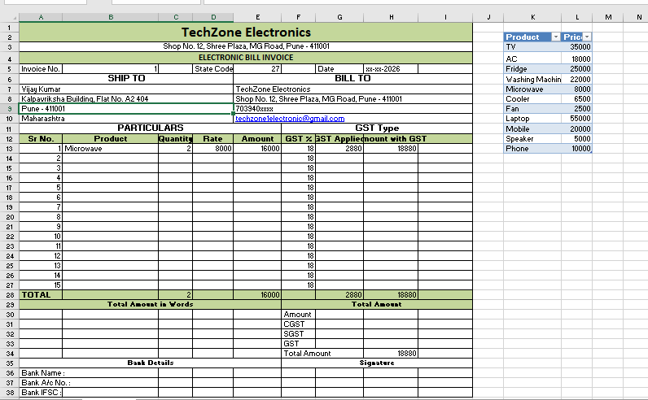

# Smart Invoice Generator (Excel)

## Overview

A professional invoice generator built in Microsoft Excel using formulas, data validation, and automation.

---

## Features

- Product dropdown
- Automatic price lookup
- Quantity calculation
- GST calculation
- Grand Total
- Automatic invoice generation
- Print-ready layout

---

## Skills Used

- Microsoft Excel
- Data Validation
- IF
- XLOOKUP / VLOOKUP
- SUM
- GST Calculation
- Formatting

---

## Screenshots

### Invoice

---

## Future Improvements

- Print button using VBA
- PDF Export
- Customer Database
- Automatic Invoice Number

---

## Author

Alisha Khot
